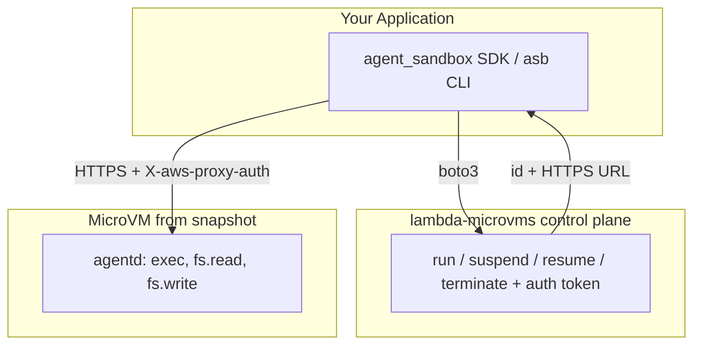

# agent-sandbox-os

[](LICENSE)
[](https://www.python.org/downloads/)

Easy, fast, isolated **microVM sandboxes** for untrusted workloads (AI agents,
user code, CI jobs), backed by [**AWS Lambda MicroVMs**](https://aws.amazon.com/lambda/lambda-microvms/)
and provisioned with **bare `boto3`** (no Pulumi or other IaC engine required).

Each sandbox is a Firecracker MicroVM with VM-level isolation, snapshot-based
fast start, a dedicated HTTPS endpoint, and suspend/resume for up to 8 hours.

## Contents

- [Components](#components)
- [Architecture](#architecture)
- [Layout](#layout)
- [Prerequisites](#prerequisites)
- [1. Install the SDK/CLI](#1-install-the-sdkcli)
- [2. Configure and deploy the infrastructure](#2-configure-and-deploy-the-infrastructure)
- [3. Use the SDK](#3-use-the-sdk)
- [4. Use the `asb` CLI](#4-use-the-asb-cli)
- [5. Serve a web app from a sandbox](#5-serve-a-web-app-from-a-sandbox)
- [Use it from an AI agent (MCP)](#use-it-from-an-ai-agent-mcp)
- [Local guest-image smoke test](#local-guest-image-smoke-test)
- [Status / not yet implemented](#status--not-yet-implemented)
- [Contributing](#contributing)
- [License](#license)

## Components

| Component | Description |
| --- | --- |
| Runtime | AWS Lambda MicroVMs (managed Firecracker) via `boto3` `lambda-microvms` |
| Guest agent | `guest/agentd` FastAPI app baked into the MicroVM image |
| SDK | `agent_sandbox.Sandbox.create(...)` |
| Transport | `agent_sandbox.agent_client.AgentClient` (HTTPS + `X-aws-proxy-auth`) |
| CLI | `asb` |
| Infrastructure | `asb infra` (bare `boto3` provisioner, `agent_sandbox.infra`) driven by `sandbox.yaml` |
| MCP server | `agent_sandbox_mcp` (FastMCP server, optional `[mcp]` extra, launched with `asb mcp`) |

## Architecture



## Layout

- `sdk/agent_sandbox/` — embeddable Python SDK + `asb` CLI
- `sdk/agent_sandbox/infra/` — bare-`boto3` provisioner (IAM role, S3 bucket, egress SG, MicroVM image) driven by `sandbox.yaml`, with a local JSON state file
- `sdk/agent_sandbox_mcp/` — the MCP server (FastMCP) that exposes sandboxes to AI agents; optional `[mcp]` extra (see [Use it from an AI agent (MCP)](#use-it-from-an-ai-agent-mcp) below)
- `guest/` — the MicroVM image (`Dockerfile` + `agentd` FastAPI guest agent)
- `sandbox.yaml` — infrastructure config (single source of truth)
- `examples/run_code.py` — minimal end-to-end example
- `examples/serve_fastapi.py` — run a FastAPI app inside a sandbox and browse it locally

## Prerequisites

- Python 3.11+, [`uv`](https://docs.astral.sh/uv/)
- AWS CLI v2 recent enough to include `lambda-microvms`, with credentials configured
- Docker (only to test the guest image locally; the build itself happens in AWS)
- A region where Lambda MicroVMs is available: `us-east-1`, `us-east-2`, `us-west-2`, `eu-west-1`, `ap-northeast-1`. Pick any of these via `region:` in `sandbox.yaml` or the standard `AWS_DEFAULT_REGION` / `AWS_REGION` environment variable.

No IaC engine or external CLI is required — `asb infra` provisions everything
with `boto3` (a core dependency) and tracks state in a local JSON file.

## 1. Install the SDK/CLI

Clone the repository and install with [`uv`](https://docs.astral.sh/uv/) (recommended) or `pip`:

```bash
git clone https://github.com/dhanababum/agent-sandbox-os.git
cd agent-sandbox-os

uv sync                 # base SDK + CLI
uv sync --extra infra   # also installs PyYAML (to read sandbox.yaml) for `asb infra`
# or, with pip in a virtualenv:
#   pip install -e ".[infra]"
```

This installs the `asb` command on your `PATH`. Verify with `asb --help`.

## 2. Configure and deploy the infrastructure

All infrastructure variables live in a single `sandbox.yaml`. Each resource is
**reuse-or-create**: set an existing id/arn to reuse it, or leave it empty to
have `asb infra` create it.

```bash
asb infra init            # scaffold sandbox.yaml (edit as needed)
asb infra preview         # see what will change
asb infra up              # create/update; prints outputs (image_arn, role, ...)
```

`sandbox.yaml` (created by `asb infra init`):

```yaml
project: agent-sandbox-os
stack: dev
region: us-east-1

image:
  name: agent-sandbox-guest
  guest_dir: ./guest            # zipped -> S3 -> create_microvm_image
  base_image_arn: ""            # empty -> newest managed base image (e.g. al2023)
  base_image_version: ""        # optional

role:
  arn: ""                       # set -> reuse; empty -> create
  name: agent-sandbox-exec
  extra_policy_arns: []         # optional managed policy ARNs to attach

bucket:
  name: ""                      # set -> reuse; empty -> create

network:                        # OPTIONAL. Omit entirely for default public egress.
  egress:                       # VPC egress network connector (reuse-or-create).
    connector_arn: ""           # set -> reuse; empty -> create a VPC_EGRESS connector
    name: agent-sandbox-egress  # name for the created connector (+ SG)
    vpc_id: ""                  # empty -> default VPC
    subnet_ids: []              # subnet ids or Name tags; empty -> discover in VPC
    security_group_id: ""       # set -> reuse; empty -> create egress-only SG
    operator_role_arn: ""       # set -> reuse; empty -> create NetworkConnectorOperatorRole
```

`asb infra` is a bare-`boto3` provisioner (under `agent_sandbox.infra`); each
resource is created idempotently and recorded in a local JSON state file, so no
IaC engine or external CLI is needed.

Other infra commands: `asb infra refresh`, `asb infra destroy`,
`asb infra output [NAME]`. Use `asb infra up --rebuild` to force a new MicroVM
image version even when one is already active.

### State file (no account or token required)

`asb infra` records what it created — and whether each resource was created by
it (managed) versus reused from your `sandbox.yaml` — in a local JSON file at
`~/.agent_sandbox/infra-state.json` (override with `AGENT_SANDBOX_INFRA_STATE`).
`asb infra destroy` only tears down resources it manages, so reused resources
are left untouched. This file also holds the outputs (`image_arn`,
`execution_role_arn`, `build_bucket`) that the SDK/CLI auto-wire from.

## 3. Use the SDK

After `asb infra up`, the CLI auto-reads `image_arn`, `execution_role_arn`, and
any network outputs from the stack. For the raw SDK you can either rely on that
or export env vars explicitly:

```bash
export AGENT_SANDBOX_IMAGE_ARN=$(asb infra output image_arn)
export AGENT_SANDBOX_EXECUTION_ROLE_ARN=$(asb infra output execution_role_arn)
python examples/run_code.py   # -> Hello from a microVM!
```

On Windows PowerShell, use `$env:` instead of `export`:

```powershell
$env:AGENT_SANDBOX_IMAGE_ARN = (asb infra output image_arn)
$env:AGENT_SANDBOX_EXECUTION_ROLE_ARN = (asb infra output execution_role_arn)
python examples/run_code.py
```

```python
import asyncio
from agent_sandbox import Sandbox

async def main():
    sandbox = await Sandbox.create("my-sandbox", cpus=1, memory=512)
    out = await sandbox.exec("python", ["-c", "print('hi')"])
    print(out.stdout_text)
    await sandbox.stop()

asyncio.run(main())
```

## 4. Use the `asb` CLI

After `asb infra up`, `--image`/`--role` are auto-read from the stack, so most
commands need no flags:

```bash
asb create app                    # auto-wired image/role from infra outputs
asb exec app -- python -c "import this"
asb ls
asb ps app
asb inspect app
asb logs app
asb metrics app
asb stop app      # suspend (state preserved)
asb start app     # resume
asb rm app        # terminate

# ephemeral one-shot
asb run "$(asb infra output image_arn)" -- python -c "print('one-shot')"

# images
asb image build ./guest --name my-guest --bucket "$(asb infra output build_bucket)"
asb image ls
asb image rm <image-arn>

# infrastructure
asb infra init | preview | up | refresh | destroy | output [NAME]
```

You can still pass `--image`/`--role` explicitly (or set `AGENT_SANDBOX_IMAGE_ARN`
/ `AGENT_SANDBOX_EXECUTION_ROLE_ARN`) to override the auto-wired values.

The CLI keeps a local name → MicroVM map at `~/.agent_sandbox/state.json`
(override with `AGENT_SANDBOX_STATE`), since AWS has no concept of sandbox names.

### Networking

Lambda MicroVMs use **network connectors** (not subnets/security groups) for
ingress/egress, attached at `run_microvm` time. By default MicroVMs get managed
egress (e.g. `INTERNET_EGRESS`) from the image, so `asb create`/`run` need no
network config. Custom connectors (VPC egress, `SHELL_INGRESS`, etc.) can be
passed via the SDK's `ingress_network_connectors` / `egress_network_connectors`.

Note: the `network:` block in `sandbox.yaml` (VPC/subnets/SG) is a placeholder for
a future connector-based model and is not currently wired into `run_microvm`.

### CLI semantics

- `asb stop` **suspends** (resume with `asb start`); `asb rm` **terminates**.
- `asb image build` zips a directory, uploads it to S3, and registers a MicroVM image (there is no local OCI cache on AWS).
- `asb logs`/`asb metrics` read CloudWatch (best-effort; override the log group with `--log-group`).

## 5. Serve a web app from a sandbox

`asb forward` runs a local reverse proxy so you can reach a service running
*inside* a sandbox from your browser. The [examples/serve_fastapi.py](examples/serve_fastapi.py)
script demonstrates the full flow: it writes a small FastAPI app into the VM,
starts `uvicorn`, and proxies `http://localhost:8000` to it.

```bash
python examples/serve_fastapi.py            # then open http://localhost:8000

# or forward a port for a service you started yourself:
asb forward app --remote-port 8000 --local-port 8000
```

## Use it from an AI agent (MCP)

`agent-sandbox-os` ships an [MCP](https://modelcontextprotocol.io/) server
(`agent_sandbox_mcp`) that lets AI agents create isolated microVM sandboxes,
execute code, manage files, read logs, and monitor resources. It mirrors the
tool-naming conventions and response patterns of
[microsandbox-mcp](https://github.com/superradcompany/microsandbox-mcp), but is
implemented in Python with **FastMCP** on top of the `agent_sandbox` SDK.

### Installation

The MCP server is gated behind the `mcp` extra:

```bash
uv sync --extra mcp
# or: pip install 'agent-sandbox-os[mcp]'
# in a source checkout: uv pip install -e '.[mcp]'
```

Provision the backend first (`asb infra up`) so image/role ARNs resolve, or set
`AGENT_SANDBOX_IMAGE_ARN` / `AGENT_SANDBOX_EXECUTION_ROLE_ARN`.

The server runs over stdio. It is exposed two ways:

- `asb mcp` — via the bundled CLI (recommended for source checkouts).
- `agent-sandbox-mcp` / `python -m agent_sandbox_mcp` — after installing the `mcp` extra.

**Claude Code**

```
claude mcp add agent-sandbox -- asb mcp
```

**Cursor** — add to `~/.cursor/mcp.json`:

```json
{
  "mcpServers": {
    "agent-sandbox": {
      "command": "asb",
      "args": ["mcp"]
    }
  }
}
```

**VS Code** — add to `.vscode/mcp.json`:

```json
{
  "servers": {
    "agent-sandbox": {
      "command": "asb",
      "args": ["mcp"]
    }
  }
}
```

**Any stdio client** (after `pip install 'agent-sandbox-os[mcp]'`):

```json
{
  "mcpServers": {
    "agent-sandbox": {
      "command": "agent-sandbox-mcp"
    }
  }
}
```

### Available Tools

Every tool returns a JSON envelope: `{ "ok": true, "data": ... }` on success or
`{ "ok": false, "error": { "code", "message", ... } }` on failure. Large command
output, logs, and file reads are capped by default and include truncation
metadata (`truncated`, `total_bytes`, `returned_bytes`) when shortened.

**Runtime**

| Tool | Description |
| --- | --- |
| `runtime_check` | Check boto3, the `lambda-microvms` client, AWS credentials, and resolved image/role ARNs |
| `runtime_install` | Explain how to provision the backend (`asb infra up`); reports current status |

**Sandbox Lifecycle**

| Tool | Description |
| --- | --- |
| `sandbox_run` | Create an ephemeral sandbox, run a shell command, return output, and remove it |
| `sandbox_create` | Create and boot a persistent, named sandbox tracked in local state |
| `sandbox_start` | Resume a stopped (suspended) sandbox |
| `sandbox_list` | List tracked sandboxes with live status |
| `sandbox_status` | Show status for one sandbox or all tracked sandboxes |
| `sandbox_inspect` | Return full control-plane configuration/metadata for one sandbox |
| `sandbox_stop` | Suspend a sandbox (preserves state) |
| `sandbox_remove` | Terminate a sandbox and remove it from local state |
| `sandbox_wait` | Wait until a sandbox reaches a terminal or target state |

**Command Execution**

| Tool | Description |
| --- | --- |
| `sandbox_exec` | Execute an argv command with cwd, env, and timeout |
| `sandbox_shell` | Execute a shell command string (`bash -lc`) with the same controls |

**Logs**

| Tool | Description |
| --- | --- |
| `sandbox_logs_read` | Read captured CloudWatch logs with tail, since, and grep filters |
| `sandbox_logs_stream` | Poll captured logs using a cursor and a bounded follow timeout |

**Filesystem**

| Tool | Description |
| --- | --- |
| `sandbox_fs_read` | Read a sandbox file as UTF-8 text or base64 bytes |
| `sandbox_fs_write` | Write UTF-8 text or base64 bytes to a sandbox file |
| `sandbox_fs_list` | List sandbox directory entries |
| `sandbox_fs_mkdir` | Create a sandbox directory |
| `sandbox_fs_remove` | Remove a sandbox file or directory |
| `sandbox_fs_copy` | Copy a file or directory within a sandbox |
| `sandbox_fs_rename` | Rename/move a sandbox file or directory |
| `sandbox_fs_stat` | Get sandbox path metadata |
| `sandbox_fs_exists` | Check whether a sandbox path exists |
| `sandbox_fs_copy_from_host` | Copy an allowlisted host path into a sandbox |
| `sandbox_fs_copy_to_host` | Copy a sandbox path to an allowlisted host destination |

**Metrics**

| Tool | Description |
| --- | --- |
| `sandbox_metrics` | Get point-in-time CPU/memory metrics for one sandbox |
| `sandbox_metrics_all` | Get point-in-time metrics for all tracked sandboxes |
| `sandbox_metrics_stream` | Collect a bounded number of metric samples from one sandbox |

**Images**

| Tool | Description |
| --- | --- |
| `image_list` | List account images (or `managed=true` base images) |
| `image_inspect` | Inspect a MicroVM image by ARN |
| `image_remove` | Delete an image, guarded by `confirm: true` |
| `image_prune` | Remove images unreferenced by any live MicroVM, guarded by `confirm: true` |

### Resources

| URI | Description |
| --- | --- |
| `agent-sandbox://runtime` | Runtime/config status |
| `agent-sandbox://sandboxes` | Current sandbox inventory |
| `agent-sandbox://images` | Current account image inventory |
| `agent-sandbox://policy` | Effective host-path and dangerous-operation policy |
| `agent-sandbox://schemas/sandbox-create` | JSON Schema for `sandbox_create` inputs |

### Configuration

| Env var | Default | Description |
| --- | --- | --- |
| `AGENT_SANDBOX_MCP_HOST_PATHS` | current working directory | `os.pathsep`-separated allowlist for host copy operations |
| `AGENT_SANDBOX_MCP_HOST_PATH_POLICY` | `allowlist` | Set to `unrestricted` to allow any host path |
| `AGENT_SANDBOX_MCP_ENABLE_DANGEROUS` | `0` | Reserved for future dangerous ops; destructive image ops still require `confirm: true` |
| `AGENT_SANDBOX_MCP_MAX_OUTPUT_BYTES` | `1048576` | Default cap for command output, logs, and file reads |
| `AGENT_SANDBOX_MCP_DEFAULT_TIMEOUT_MS` | `120000` | Default timeout for exec-style operations |
| `AGENT_SANDBOX_IMAGE_ARN` | from `asb infra` | MicroVM image ARN |
| `AGENT_SANDBOX_EXECUTION_ROLE_ARN` | from `asb infra` | Execution role ARN |
| `AGENT_SANDBOX_REGION` | AWS default | AWS region |
| `AGENT_SANDBOX_WORKDIR` | `/work` | Default working directory inside the VM |
| `AGENT_SANDBOX_VERIFY_TLS` | `1` | Set `0` to skip TLS verification to the MicroVM endpoint (debug only) |

### SDK Gaps

The server stays a thin adapter over the `agent_sandbox` SDK and only exposes
what the AWS Lambda MicroVMs backend supports today. The following
microsandbox-mcp capabilities are intentionally **not** implemented because the
backend has no first-class API for them:

- **Volumes** (`volume_*`) — no named-volume API.
- **Snapshots** (`snapshot_*`) — only suspend/resume exist, not content snapshots.
- **SSH / SFTP** (`sandbox_ssh_*`, `sandbox_sftp_*`) — no SSH subsystem in the guest.
- **Streaming exec sessions** (`sandbox_exec_start` / `_poll` / `_write_stdin` /
  `_signal` / `_close`) and `sandbox_drain` — `agentd`'s `/v1/exec` is a blocking,
  one-shot call, so interactive/streamed sessions are not possible without
  guest-side changes.

### MCP development

```bash
uv sync --extra dev --extra mcp     # installs mcp + deps
uv run pytest tests/mcp -q          # unit + stdio smoke tests (no AWS)
AGENT_SANDBOX_MCP_E2E=1 uv run python tests/mcp/e2e.py   # live e2e (needs infra)
```

## Local guest-image smoke test

You can exercise `agentd` without AWS:

```bash
docker build --platform linux/arm64 -t agent-sandbox-guest ./guest
docker run --rm -p 8080:8080 agent-sandbox-guest
curl localhost:8080/healthz
curl -s localhost:8080/v1/exec -H 'content-type: application/json' \
  -d '{"command":"python","args":["-c","print(1+1)"]}'
```

## Status / not yet implemented

Volumes, PTY/interactive sessions, network policy / TLS-MITM, and streaming exec
(HTTP/2 / WebSocket) are not yet implemented. See `sdk/agent_sandbox/` for
extension points.

## Contributing

Contributions are welcome! See [CONTRIBUTING.md](CONTRIBUTING.md) for how to set
up a dev environment, run the tests and linter, and open a pull request.

## License

Apache-2.0 — see [LICENSE](LICENSE).
