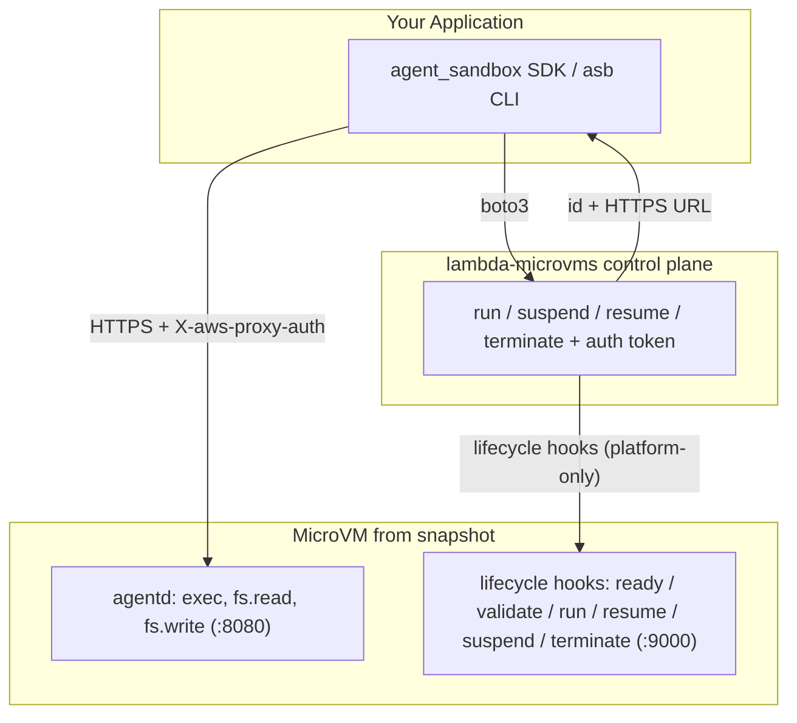

# agent-sandbox-os

[](LICENSE)
[](https://www.python.org/downloads/)

Easy, fast, isolated **microVM sandboxes** for untrusted workloads (AI agents,
user code, CI jobs), backed by [**AWS Lambda MicroVMs**](https://aws.amazon.com/lambda/lambda-microvms/)
and provisioned with **bare `boto3`** (no external IaC engine required).

Each sandbox is a Firecracker MicroVM with VM-level isolation, snapshot-based
fast start, a dedicated HTTPS endpoint, and suspend/resume for up to 8 hours.

## Why agent-sandbox-os?

Agentic workloads run **untrusted, model-generated code**. The agent decides at
runtime what to execute — shell out, install a package, hit the network — so the
blast radius is unknown ahead of time. Containers share the host kernel; for code
you didn't write, that boundary is often not strong enough, and standing up your
own VM fleet to get real isolation is a lot of undifferentiated ops work.

[AWS Lambda MicroVMs](https://docs.aws.amazon.com/lambda/latest/dg/lambda-microvms-guide.html)
give each sandbox a **Firecracker microVM** with hardware-virtualized, VM-level
isolation while staying **serverless** — no clusters, nodes, or capacity to
manage. `agent-sandbox-os` wraps that backend so an agent can treat a sandbox as
a disposable tool:

- **Safe by construction** — every command runs in a per-session microVM,
  isolated from the host and from other sessions. Ideal for AI-generated code,
  user submissions, and CI jobs.
- **Fast and stateful** — snapshot-based fast start, plus suspend/resume for up
  to 8 hours, so an agent can pause a long-running session and resume it later
  with memory and disk intact.
- **Serverless economics** — pay for what you use; no idle VM fleet sitting
  between agent runs.
- **Batteries included** — one `agent_sandbox` SDK + `asb` CLI, a per-sandbox
  HTTPS endpoint, and a built-in **MCP server** so Claude, Cursor, Goose, and
  other agents can create, run, and manage sandboxes as native tools.
- **No IaC engine** — infrastructure is provisioned with bare `boto3` and tracked
  in a local state file; nothing else to install or operate.

### Use cases

**Developer workloads that outgrow the laptop.** Multi-agent orchestration is
memory-hungry — a handful of concurrent agents, each with its own toolchain and
build tree, will exhaust local RAM long before it exhausts your patience. Each
sandbox gets its own CPU/memory allocation in AWS (`asb create app --cpus 2 -m
2048`), so you scale out by adding microVMs rather than by buying RAM.

**Local coding agents that run unattended.** The agent shells out, installs
packages, and rewrites files inside the microVM — not on your machine. It can't
touch your home directory, and you don't have to sit there approving each
command to be sure of that.

**Network you actually control.** By default a sandbox gets managed egress from
the image. Define a VPC egress connector in `sandbox.yaml` (`network.egress`) and
every outbound connection leaves through a security group you own, so you decide
which hosts and ports the workload can reach. Ingress is opt-in per sandbox via
the SDK's `ingress_network_connectors` (e.g. `SHELL_INGRESS`) — nothing is
reachable from outside unless you attach a connector. See
[Networking](#networking).

**Credentials scoped by IAM, not baked into the image.** Attach managed policies
to the MicroVM execution role with `role.extra_policy_arns` in `sandbox.yaml`;
code inside the VM then reads from Secrets Manager, SSM Parameter Store, or S3
through that role. No long-lived keys travel into the sandbox, and the blast
radius of a compromised sandbox is whatever that one role allows.

**View a sandbox dev server in your local browser.** `asb forward app -r 8000 -l
8000` runs a local reverse proxy into the VM, so a React, Vite, or FastAPI dev
server running inside the sandbox opens at `http://localhost:8000`. See
[Serve a web app from a sandbox](#5-serve-a-web-app-from-a-sandbox).

**Suspend, resume, and terminate out of the box.** `asb stop` suspends with
memory and disk intact, `asb start` resumes, `asb rm` tears down. A session can
stay alive across up to **8 hours** of work without you paying for it to idle.

**A sandbox per code session.** Named sandboxes are tracked in local state, so
several concurrent sessions — one per agent, per branch, per experiment — each
get their own microVM, isolated from one another and independently
suspendable.

**One image, many VMs.** Build the guest image once (`asb image build ./guest`),
then create as many microVMs from it as you need — different workloads, same
reproducible base, no rebuild per sandbox.

**One command to stand up the backend.** `asb infra up` provisions the MicroVM
image, execution role, S3 build bucket, and optional network connectors with bare
`boto3`, recording everything in a local state file.

## Contents

- [Why agent-sandbox-os?](#why-agent-sandbox-os)
  - [Use cases](#use-cases)
- [Components](#components)
- [Architecture](#architecture)
- [Prerequisites](#prerequisites)
- [1. Install the SDK/CLI](#1-install-the-sdkcli)
- [2. Configure and deploy the infrastructure](#2-configure-and-deploy-the-infrastructure)
- [3. Use the SDK](#3-use-the-sdk)
- [4. Use the `asb` CLI](#4-use-the-asb-cli)
- [5. Serve a web app from a sandbox](#5-serve-a-web-app-from-a-sandbox)
- [Environment variables](#environment-variables)
- [Use it from an AI agent (MCP)](#use-it-from-an-ai-agent-mcp)
- [Guest agent & lifecycle hooks](#guest-agent--lifecycle-hooks)
- [Local guest-image smoke test](#local-guest-image-smoke-test)
- [Status / not yet implemented](#status--not-yet-implemented)
- [Contributing](#contributing)
- [License](#license)

## Components

| Component | Description |
| --- | --- |
| Runtime | AWS Lambda MicroVMs (managed Firecracker) via `boto3` `lambda-microvms` |
| Guest agent | `guest/agentd` — FastAPI **agentd** (exec/fs API on port 8080) plus a **lifecycle-hook** server (port 9000), run together via `agentd.serve` and baked into the MicroVM image |
| SDK | `agent_sandbox.Sandbox.create(...)` |
| Transport | `agent_sandbox.agent_client.AgentClient` (HTTPS + `X-aws-proxy-auth`) |
| CLI | `asb` |
| Infrastructure | `asb infra` (bare `boto3` provisioner, `agent_sandbox.infra`) driven by `sandbox.yaml`; PyYAML ships in the base install |
| MCP server | `agent_sandbox_mcp` (FastMCP server, optional `[mcp]` extra, launched with `asb mcp`) |

## Architecture



## Prerequisites

- Python 3.11+, [`uv`](https://docs.astral.sh/uv/)
- AWS CLI v2 recent enough to include `lambda-microvms`, with credentials configured
- Docker (only to test the guest image locally; the build itself happens in AWS)
- A region where Lambda MicroVMs is available: `us-east-1`, `us-east-2`, `us-west-2`, `eu-west-1`, `ap-northeast-1`. Pick any of these via `region:` in `sandbox.yaml` or the standard `AWS_DEFAULT_REGION` / `AWS_REGION` environment variable.

No IaC engine or external CLI is required — `asb infra` provisions everything
with `boto3` (a core dependency) and tracks state in a local JSON file.

## 1. Install the SDK/CLI

Clone the repository and install with [`uv`](https://docs.astral.sh/uv/) (recommended) or `pip`:

```bash
git clone https://github.com/dhanababum/agent-sandbox-os.git
cd agent-sandbox-os

uv sync                 # SDK + CLI + infra (PyYAML is a base dependency)
uv sync --extra mcp     # + MCP server (FastMCP) — see the MCP section below
uv sync --extra isal    # + faster ISA-L guest-image zipping (optional accelerator)
# or, with pip in a virtualenv:
#   pip install -e .          # SDK + CLI + infra
#   pip install -e ".[mcp]"   # + MCP server
```

This installs the `asb` command on your `PATH`. Verify with `asb --help`.

> Infrastructure support (`asb infra`, reading `sandbox.yaml`) is included in the
> base install — no extra needed. The legacy `[infra]` extra still resolves but
> is now an empty no-op.

## 2. Configure and deploy the infrastructure

All infrastructure variables live in a single `sandbox.yaml`. Each resource is
**reuse-or-create**: set an existing id/arn to reuse it, or leave it empty to
have `asb infra` create it.

```bash
asb infra init            # scaffold sandbox.yaml (edit as needed)
asb infra preview         # see what will change
asb infra up              # create/update; prints outputs (image_arn, role, ...)
```

`sandbox.yaml` (created by `asb infra init`):

```yaml
project: agent-sandbox-os
stack: dev
region: us-east-1

image:
  name: agent-sandbox-guest
  guest_dir: ./guest            # zipped -> S3 -> create_microvm_image
  base_image_arn: ""            # empty -> newest managed base image (e.g. al2023)
  base_image_version: ""        # optional

role:
  arn: ""                       # set -> reuse; empty -> create
  name: agent-sandbox-exec
  extra_policy_arns: []         # optional managed policy ARNs to attach

bucket:
  name: ""                      # set -> reuse; empty -> create

network:                        # OPTIONAL. Omit entirely for default public egress.
  egress:                       # VPC egress network connector (reuse-or-create).
    connector_arn: ""           # set -> reuse; empty -> create a VPC_EGRESS connector
    name: agent-sandbox-egress  # name for the created connector (+ SG)
    vpc_id: ""                  # empty -> default VPC
    subnet_ids: []              # subnet ids or Name tags; empty -> discover in VPC
    security_group_id: ""       # set -> reuse; empty -> create egress-only SG
    operator_role_arn: ""       # set -> reuse; empty -> create NetworkConnectorOperatorRole
```

`asb infra` is a bare-`boto3` provisioner (under `agent_sandbox.infra`); each
resource is created idempotently and recorded in a local JSON state file, so no
IaC engine or external CLI is needed.

Other infra commands: `asb infra refresh`, `asb infra destroy`,
`asb infra output [NAME]`. Use `asb infra up --rebuild` to force a new MicroVM
image version even when one is already active.

### State file (no account or token required)

`asb infra` records what it created — and whether each resource was created by
it (managed) versus reused from your `sandbox.yaml` — in a local JSON file at
`~/.agent_sandbox/infra-state.json` (override with `AGENT_SANDBOX_INFRA_STATE`).
`asb infra destroy` only tears down resources it manages, so reused resources
are left untouched. This file also holds the outputs (`image_arn`,
`execution_role_arn`, `build_bucket`) that the SDK/CLI auto-wire from.

## 3. Use the SDK

After `asb infra up`, the CLI auto-reads `image_arn`, `execution_role_arn`, and
any network outputs from the stack. For the raw SDK you can either rely on that
or export env vars explicitly:

```bash
export AGENT_SANDBOX_IMAGE_ARN=$(asb infra output image_arn)
export AGENT_SANDBOX_EXECUTION_ROLE_ARN=$(asb infra output execution_role_arn)
python examples/run_code.py   # -> Hello from a microVM!
```

On Windows PowerShell, use `$env:` instead of `export`:

```powershell
$env:AGENT_SANDBOX_IMAGE_ARN = (asb infra output image_arn)
$env:AGENT_SANDBOX_EXECUTION_ROLE_ARN = (asb infra output execution_role_arn)
python examples/run_code.py
```

```python
import asyncio
from agent_sandbox import Sandbox

async def main():
    sandbox = await Sandbox.create("my-sandbox", cpus=1, memory=512)
    out = await sandbox.exec("python", ["-c", "print('hi')"])
    print(out.stdout_text)
    await sandbox.stop()

asyncio.run(main())
```

## 4. Use the `asb` CLI

After `asb infra up`, `--image`/`--role` are auto-read from the stack, so most
commands need no flags:

```bash
# lifecycle (a named sandbox tracked in local state)
asb create app                    # auto-wired image/role from infra outputs
asb exec app -- python -c "import this"
asb ls                            # all tracked sandboxes + live status
asb ps app                        # one sandbox's status
asb inspect app                   # full MicroVM info as JSON
asb logs app                      # CloudWatch logs (best-effort)
asb metrics app                   # CloudWatch metrics (best-effort)
asb stop app                      # suspend (memory/disk preserved)
asb start app                     # resume
asb rm app                        # terminate + drop from local state

# ephemeral one-shot (image ARN is a required positional — not auto-wired)
asb run "$(asb infra output image_arn)" -- python -c "print('one-shot')"

# serve a port from inside the sandbox on localhost (see section 5)
asb forward app --remote-port 8000 --local-port 8000

# images
asb image build ./guest --name my-guest --bucket "$(asb infra output build_bucket)"
asb image ls                      # your images (--managed for AWS base images, --json for raw)
asb image rm <image-arn>

# infrastructure
asb infra init | preview | up | refresh | destroy | output [NAME]

# run the MCP server over stdio (see the MCP section)
asb mcp
```

**Common flags**

- `asb create` / `asb run`: `--image/-i`, `--role`, `--cpus`, `--memory/-m`
  (default 512), `--region`, and `--egress-connector <arn>` / `--egress/-e`
  (attach the egress connector from infra outputs).
- Every lifecycle/status command takes `--region`.
- `asb logs`: `--log-group` to override the CloudWatch group.
- `asb image ls`: `--managed` (AWS base images), `--json` (raw output).
- `asb forward`: `--remote-port/-r` (required), `--local-port/-l`,
  `--no-verify-tls`, `--poll-interval`. The reserved lifecycle-hook port
  (`AGENT_SANDBOX_HOOK_PORT`, default `9000`) is rejected — see
  [Guest agent & lifecycle hooks](#guest-agent--lifecycle-hooks).
- `asb infra up`: `--file/-f` is repeatable and accepts directories
  (multi-project), plus `--stack/-s`, `--rebuild`, `--parallelism/-p`.

`asb create` resolves image/role from the flag → env var
(`AGENT_SANDBOX_IMAGE_ARN` / `AGENT_SANDBOX_EXECUTION_ROLE_ARN`) → `asb infra`
outputs, in that order, so after `asb infra up` most commands need no flags.
`asb run` is the exception: it takes the image ARN as a required positional
argument and is **not** auto-wired.

The CLI keeps a local name → MicroVM map at `~/.agent_sandbox/state.json`
(override with `AGENT_SANDBOX_STATE`), since AWS has no concept of sandbox names.

> `image inspect` and `image prune` are available only as **MCP tools**, not as
> `asb` CLI commands.

### Networking

Lambda MicroVMs use **network connectors** (not subnets/security groups) for
ingress/egress, attached at `run_microvm` time. By default MicroVMs get managed
egress (e.g. `INTERNET_EGRESS`) from the image, so `asb create`/`run` need no
network config.

For custom VPC egress, provision a connector in `sandbox.yaml`'s `network.egress`
block (`asb infra up` creates/records `egress_network_connector_arn`), then
attach it per sandbox with `asb create app --egress` (pulls the connector from
infra outputs) or `--egress-connector <arn>`. The SDK accepts
`ingress_network_connectors` / `egress_network_connectors` directly for finer
control (e.g. `SHELL_INGRESS`).

### CLI semantics

- `asb stop` **suspends** (resume with `asb start`); `asb rm` **terminates**.
- `asb image build` zips a directory, uploads it to S3, and registers a MicroVM image (there is no local OCI cache on AWS).
- `asb logs`/`asb metrics` read CloudWatch (best-effort; override the log group with `--log-group`).

## 5. Serve a web app from a sandbox

`asb forward` runs a local reverse proxy so you can reach a service running
*inside* a sandbox from your browser. The [examples/serve_fastapi.py](examples/serve_fastapi.py)
script demonstrates the full flow: it writes a small FastAPI app into the VM,
starts `uvicorn`, and proxies `http://localhost:8000` to it.

```bash
python examples/serve_fastapi.py            # then open http://localhost:8000

# or forward a port for a service you started yourself:
asb forward app --remote-port 8000 --local-port 8000
```

## Environment variables

The SDK and CLI are configured mainly through `sandbox.yaml` + `asb infra`
outputs, so **most setups need no environment variables at all**. The two below
are the only values that must be resolvable; everything else is an optional
override.

**Required** — each needs *one of*: a CLI flag, an environment variable, or an
`asb infra up` output (auto-wired). After `asb infra up` both are auto-wired.

| Variable | Purpose |
| --- | --- |
| `AGENT_SANDBOX_IMAGE_ARN` | MicroVM image ARN used by `asb create` / `asb run` and the SDK |
| `AGENT_SANDBOX_EXECUTION_ROLE_ARN` | Execution role ARN for the MicroVM |

AWS credentials and region come from the standard boto3 chain
(`AWS_REGION` / `AWS_DEFAULT_REGION`, `AWS_PROFILE`, instance role, etc.). The
region must be one where Lambda MicroVMs is available (see Prerequisites).

**Optional overrides**

| Variable | Default | Purpose |
| --- | --- | --- |
| `AGENT_SANDBOX_REGION` | boto3 default | Region for SDK / MCP calls |
| `AGENT_SANDBOX_STATE` | `~/.agent_sandbox/state.json` | CLI name → MicroVM map |
| `AGENT_SANDBOX_INFRA_STATE` | `~/.agent_sandbox/infra-state.json` | `asb infra` state file |
| `AGENT_SANDBOX_SETUP` | `sandbox.yaml` | Infra config path (search order: `$AGENT_SANDBOX_SETUP` → `sandbox.yaml` → legacy `setup.yaml`) |
| `AGENT_SANDBOX_EGRESS_CONNECTOR` | from infra output | VPC egress network connector ARN to attach |
| `AGENT_SANDBOX_WORKDIR` | `/work` | Default working directory inside the VM |
| `AGENT_SANDBOX_VERIFY_TLS` | `1` | Set `0` to skip TLS verification to the MicroVM endpoint (debug only) |
| `AGENT_SANDBOX_AGENT_PORT` | `8080` | agentd application port the SDK scopes auth tokens to (must match the guest's `AGENTD_PORT`) |
| `AGENT_SANDBOX_HOOK_PORT` | `9000` | Reserved lifecycle-hook port; `asb forward` refuses it (must match the guest's `AGENTD_HOOK_PORT`) |

The MCP server adds a further set of `AGENT_SANDBOX_MCP_*` tuning knobs —
see [Configuration](#configuration) under the MCP section below.

## Use it from an AI agent (MCP)

`agent-sandbox-os` ships an [MCP](https://modelcontextprotocol.io/) server
(`agent_sandbox_mcp`) that lets AI agents create isolated microVM sandboxes,
execute code, manage files, read logs, and monitor resources. It mirrors the
tool-naming conventions and response patterns of
[microsandbox-mcp](https://github.com/superradcompany/microsandbox-mcp), but is
implemented in Python with **FastMCP** on top of the `agent_sandbox` SDK.

### Installation

The MCP server ships in the optional **`mcp` extra**. It **must** be installed —
without it `asb mcp` exits immediately and the client reports
**"Failed to connect"**. Install it one of these ways:

**Source checkout (development):**

```bash
uv sync --extra mcp
# or, with pip: pip install -e '.[mcp]'
```

**Global tool (so `asb` is on your `PATH` everywhere)** — include the `[mcp]`
extra:

```bash
# from a source checkout (editable — tracks your working tree):
uv tool install --editable ".[mcp]" --force
# or from PyPI:
uv tool install "agent-sandbox-os[mcp]"
```

> **Gotcha:** keep the `[mcp]` extra every time you (re)install the global tool.
> `uv tool install --reinstall .` **without** `[mcp]` drops the `mcp` package and
> breaks `asb mcp` — re-run the command above with `".[mcp]"` to fix it.

Verify it's installed and reachable:

```bash
asb mcp     # starts the stdio server (Ctrl+C to stop). An "mcp not available"
            # message instead means the [mcp] extra is missing — see above.
which asb   # e.g. ~/.local/bin/asb — use this absolute path if your MCP client
            # runs in a different environment and can't find asb on its PATH.
```

Provision the backend first (`asb infra up`) so image/role ARNs resolve, or set
`AGENT_SANDBOX_IMAGE_ARN` / `AGENT_SANDBOX_EXECUTION_ROLE_ARN` (see
[Environment variables](#environment-variables)) — otherwise the client connects
but tool calls error at runtime.

The server runs over stdio and can be launched three ways — use whichever your
client makes easiest:

- `asb mcp` — via the bundled CLI (recommended).
- `agent-sandbox-mcp` — the standalone console script (same server).
- `python -m agent_sandbox_mcp` — module form, handy when `asb` isn't on `PATH`.

All the client snippets below use `asb mcp`. If your MCP client runs in a
different environment than your shell (so `asb` isn't on its `PATH`), swap in the
absolute path to `asb`, or use `uv run --directory /path/to/agent-sandbox-os asb
mcp`. Wire the required ARNs through the client's `env` block when they aren't
already exported, as shown in the generic example.

**Claude Code**

```bash
claude mcp add agent-sandbox -- asb mcp
```

**Claude Desktop** — add to `claude_desktop_config.json` (macOS:
`~/Library/Application Support/Claude/`, Windows: `%APPDATA%\Claude\`):

```json
{
  "mcpServers": {
    "agent-sandbox": {
      "command": "asb",
      "args": ["mcp"]
    }
  }
}
```

**Cursor** — add to `~/.cursor/mcp.json` (or `.cursor/mcp.json` in a project):

```json
{
  "mcpServers": {
    "agent-sandbox": {
      "command": "asb",
      "args": ["mcp"]
    }
  }
}
```

**VS Code** — add to `.vscode/mcp.json`:

```json
{
  "servers": {
    "agent-sandbox": {
      "command": "asb",
      "args": ["mcp"]
    }
  }
}
```

**Windsurf** — add to `~/.codeium/windsurf/mcp_config.json` (same `mcpServers`
shape as Cursor/Claude Desktop above).

**Goose** — Goose uses a YAML config. Either run `goose configure` → *Add
Extension* → *Command-line Extension* and enter `asb mcp`, or add an entry to
`~/.config/goose/config.yaml`:

```yaml
extensions:
  agent-sandbox:
    enabled: true
    type: stdio
    cmd: asb
    args: [mcp]
```

**pi / any other stdio client** — most clients share the same shape. This
generic block also shows wiring the required ARNs via `env` when they aren't
exported in the client's environment:

```json
{
  "mcpServers": {
    "agent-sandbox": {
      "command": "asb",
      "args": ["mcp"],
      "env": {
        "AGENT_SANDBOX_IMAGE_ARN": "arn:aws:lambda:us-east-1:...:microvm-image/...",
        "AGENT_SANDBOX_EXECUTION_ROLE_ARN": "arn:aws:iam::...:role/agent-sandbox-exec"
      }
    }
  }
}
```

### Available Tools

Every tool returns a JSON envelope: `{ "ok": true, "data": ... }` on success or
`{ "ok": false, "error": { "code", "message", ... } }` on failure. Large command
output, logs, and file reads are capped by default and include truncation
metadata (`truncated`, `total_bytes`, `returned_bytes`) when shortened.

**Runtime**

| Tool | Description |
| --- | --- |
| `runtime_check` | Check boto3, the `lambda-microvms` client, AWS credentials, and resolved image/role ARNs |
| `runtime_install` | Explain how to provision the backend (`asb infra up`); reports current status |

**Sandbox Lifecycle**

| Tool | Description |
| --- | --- |
| `sandbox_run` | Create an ephemeral sandbox, run a shell command, return output, and remove it |
| `sandbox_create` | Create and boot a persistent, named sandbox tracked in local state |
| `sandbox_start` | Resume a stopped (suspended) sandbox |
| `sandbox_list` | List tracked sandboxes with live status |
| `sandbox_status` | Show status for one sandbox or all tracked sandboxes |
| `sandbox_inspect` | Return full control-plane configuration/metadata for one sandbox |
| `sandbox_stop` | Suspend a sandbox (preserves state) |
| `sandbox_remove` | Terminate a sandbox and remove it from local state |
| `sandbox_wait` | Wait until a sandbox reaches a terminal or target state |

**Command Execution**

| Tool | Description |
| --- | --- |
| `sandbox_exec` | Execute an argv command with cwd, env, and timeout |
| `sandbox_shell` | Execute a shell command string (`bash -lc`) with the same controls |

**Logs**

| Tool | Description |
| --- | --- |
| `sandbox_logs_read` | Read captured CloudWatch logs with tail, since, and grep filters |
| `sandbox_logs_stream` | Poll captured logs using a cursor and a bounded follow timeout |

**Filesystem**

| Tool | Description |
| --- | --- |
| `sandbox_fs_read` | Read a sandbox file as UTF-8 text or base64 bytes |
| `sandbox_fs_write` | Write UTF-8 text or base64 bytes to a sandbox file |
| `sandbox_fs_list` | List sandbox directory entries |
| `sandbox_fs_mkdir` | Create a sandbox directory |
| `sandbox_fs_remove` | Remove a sandbox file or directory |
| `sandbox_fs_copy` | Copy a file or directory within a sandbox |
| `sandbox_fs_rename` | Rename/move a sandbox file or directory |
| `sandbox_fs_stat` | Get sandbox path metadata |
| `sandbox_fs_exists` | Check whether a sandbox path exists |
| `sandbox_fs_copy_from_host` | Copy an allowlisted host path into a sandbox |
| `sandbox_fs_copy_to_host` | Copy a sandbox path to an allowlisted host destination |

**Metrics**

| Tool | Description |
| --- | --- |
| `sandbox_metrics` | Get point-in-time CPU/memory metrics for one sandbox |
| `sandbox_metrics_all` | Get point-in-time metrics for all tracked sandboxes |
| `sandbox_metrics_stream` | Collect a bounded number of metric samples from one sandbox |

**Images**

| Tool | Description |
| --- | --- |
| `image_list` | List account images (or `managed=true` base images) |
| `image_inspect` | Inspect a MicroVM image by ARN |
| `image_remove` | Delete an image, guarded by `confirm: true` |
| `image_prune` | Remove images unreferenced by any live MicroVM, guarded by `confirm: true` |

### Resources

| URI | Description |
| --- | --- |
| `agent-sandbox://runtime` | Runtime/config status |
| `agent-sandbox://sandboxes` | Current sandbox inventory |
| `agent-sandbox://images` | Current account image inventory |
| `agent-sandbox://policy` | Effective host-path and dangerous-operation policy |
| `agent-sandbox://schemas/sandbox-create` | JSON Schema for `sandbox_create` inputs |

### Configuration

The server reuses the SDK/CLI variables from
[Environment variables](#environment-variables) (image/role ARN, region, egress
connector, TLS, workdir) and adds these MCP-specific tuning knobs:

| Env var | Default | Description |
| --- | --- | --- |
| `AGENT_SANDBOX_MCP_HOST_PATHS` | current working directory | `os.pathsep`-separated allowlist for host copy operations |
| `AGENT_SANDBOX_MCP_HOST_PATH_POLICY` | `allowlist` | Set to `unrestricted` to allow any host path |
| `AGENT_SANDBOX_MCP_ENABLE_DANGEROUS` | `0` | Reserved for future dangerous ops; destructive image ops still require `confirm: true` |
| `AGENT_SANDBOX_MCP_MAX_OUTPUT_BYTES` | `1048576` | Default cap for command output, logs, and file reads |
| `AGENT_SANDBOX_MCP_DEFAULT_TIMEOUT_MS` | `120000` | Default timeout for exec-style operations |
| `AGENT_SANDBOX_IMAGE_ARN` | from `asb infra` | MicroVM image ARN |
| `AGENT_SANDBOX_EXECUTION_ROLE_ARN` | from `asb infra` | Execution role ARN |
| `AGENT_SANDBOX_REGION` | AWS default | AWS region |
| `AGENT_SANDBOX_EGRESS_CONNECTOR` | from `asb infra` | VPC egress network connector ARN to attach |
| `AGENT_SANDBOX_WORKDIR` | `/work` | Default working directory inside the VM |
| `AGENT_SANDBOX_VERIFY_TLS` | `1` | Set `0` to skip TLS verification to the MicroVM endpoint (debug only) |

### SDK Gaps

The server stays a thin adapter over the `agent_sandbox` SDK and only exposes
what the AWS Lambda MicroVMs backend supports today. The following
microsandbox-mcp capabilities are intentionally **not** implemented because the
backend has no first-class API for them:

- **Volumes** (`volume_*`) — no named-volume API.
- **Snapshots** (`snapshot_*`) — only suspend/resume exist, not content snapshots.
- **SSH / SFTP** (`sandbox_ssh_*`, `sandbox_sftp_*`) — no SSH subsystem in the guest.
- **Streaming exec sessions** (`sandbox_exec_start` / `_poll` / `_write_stdin` /
  `_signal` / `_close`) and `sandbox_drain` — `agentd`'s `/v1/exec` is a blocking,
  one-shot call, so interactive/streamed sessions are not possible without
  guest-side changes.

### MCP development

```bash
uv sync --extra dev --extra mcp     # installs mcp + deps
uv run pytest tests/mcp -q          # unit + stdio smoke tests (no AWS)
AGENT_SANDBOX_MCP_E2E=1 uv run python tests/mcp/e2e.py   # live e2e (needs infra)
```

## Guest agent & lifecycle hooks

The guest image runs **two servers in one process** (`python -m agentd.serve`):

- **agentd** on port `8080` — the application API (`/v1/exec`, `/v1/fs/*`,
  `/healthz`) the SDK/CLI reach through the MicroVM's auth-token proxy.
- **lifecycle hooks** on port `9000` — called **only by the AWS Lambda MicroVMs
  platform** (never by your clients) at image build and MicroVM state
  transitions.

The hooks make sandboxes faster and safer with no action on your part:

| Hook | When | What it does for you |
| --- | --- | --- |
| `/ready` | during image build, before the snapshot | waits until agentd is fully serving, so the snapshot captures a ready agent — no first-`exec` race, faster starts |
| `/validate` | after build, on a test VM | smoke-tests the snapshot so a broken image fails the build instead of shipping |
| `/run` | once per VM, on start from snapshot | mints a fresh per-VM identity and reseeds randomness (fixes the shared-snapshot uniqueness pitfall) |
| `/resume` | after `asb start` (resume) | reseeds randomness / refreshes per-VM state |
| `/suspend` | before `asb stop` suspends | drains any in-flight `exec` so commands aren't frozen mid-run |
| `/terminate` | before `asb rm` tears down | flushes logs; best-effort cleanup |

Hooks are baked into the image at build time, so **rebuild to pick them up on an
existing stack**: `asb infra up --rebuild`.

**The hook port is reserved.** `asb forward` refuses `--remote-port 9000` — the
lifecycle plane is the platform's private channel and must never be
client-reachable, and auth tokens are scoped to the app port only.

**Ports are configurable** (defaults `8080` / `9000`). Override the guest with
`AGENTD_PORT` / `AGENTD_HOOK_PORT` (baked via the Dockerfile) and the SDK/CLI with
the matching `AGENT_SANDBOX_AGENT_PORT` / `AGENT_SANDBOX_HOOK_PORT`. Keep the two
hook-port values in sync — the SDK tells the platform which port to call, and the
guest must bind the same one.

## Local guest-image smoke test

You can exercise `agentd` and the hook server without AWS:

```bash
docker build --platform linux/arm64 -t agent-sandbox-guest ./guest
docker run --rm -p 8080:8080 -p 9000:9000 agent-sandbox-guest
curl localhost:8080/healthz
curl -s localhost:8080/v1/exec -H 'content-type: application/json' \
  -d '{"command":"python","args":["-c","print(1+1)"]}'

# lifecycle-hook server (normally the platform calls these, not you):
curl -s -o /dev/null -w '%{http_code}\n' -X POST \
  localhost:9000/aws/lambda-microvms/runtime/v1/ready   # -> 200 once agentd is up
```

## Status / not yet implemented

Volumes, PTY/interactive sessions, network policy / TLS-MITM, and streaming exec
(HTTP/2 / WebSocket) are not yet implemented. See `sdk/agent_sandbox/` for
extension points, and [SDK Gaps](#sdk-gaps) for how these surface (or don't) in
the MCP server.

## Contributing

Contributions are welcome! See [CONTRIBUTING.md](CONTRIBUTING.md) for how to set
up a dev environment, run the tests and linter, and open a pull request.

## License

Apache-2.0 — see [LICENSE](LICENSE).
